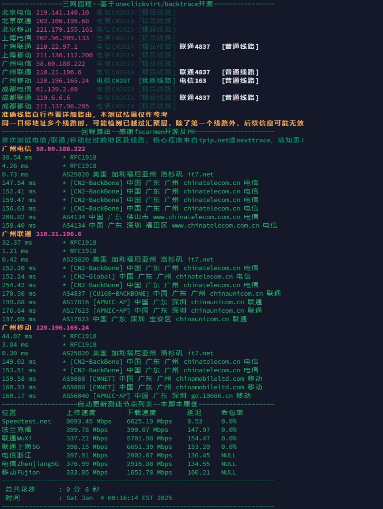
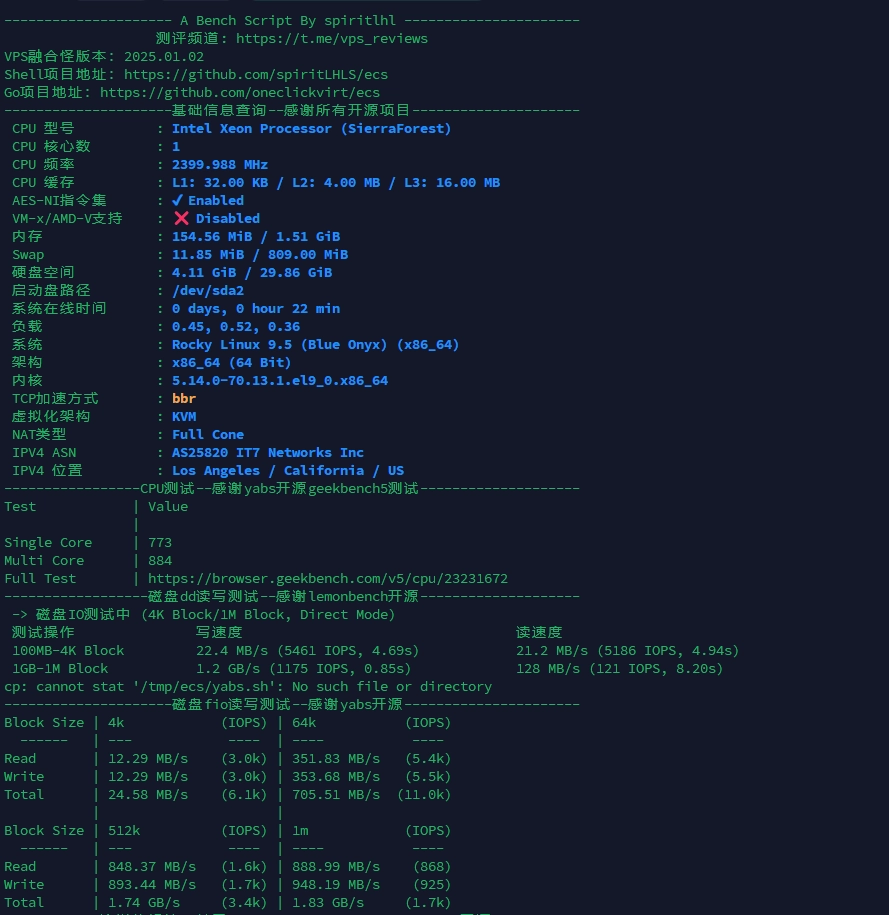
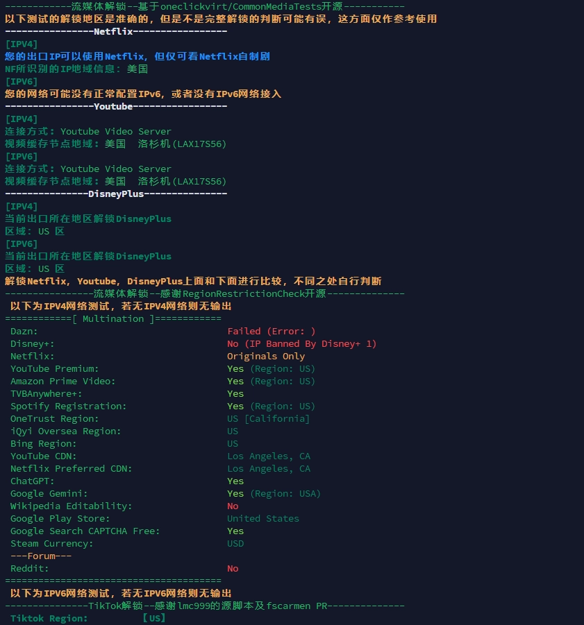

# 搬瓦工美西CN2 GIA年付41.95美元：1.5T月流量，高性价比方案实测

---

你在找一款既稳定又实惠的CN2 GIA线路VPS吗？特别是那种不用担心流量不够用、价格还能接受的方案？搬瓦工这次推出的POWERBOX套餐可能正是你需要的——每月1.5TB流量，年付仅41.95美元，CN2 GIA直连线路加持，适合需要稳定网络环境的个人用户和小型项目。

---

## 套餐配置一览

这次的POWERBOX配置看起来挺实在的，没有什么花哨的东西，就是该有的都有：

- **存储空间**：30GB SSD RAID-10阵列
- **内存**：1536MB
- **处理器**：1核心 Intel Xeon
- **月流量**：1500GB
- **带宽**：2.5Gbps

对于大多数个人用途来说，这个配置够用了。30GB空间跑几个轻量服务没问题，1.5T流量更是相当宽裕——除非你打算拿来做视频站或者疯狂跑流量，否则基本用不完。

## 实测数据说话

光看配置表不够，我们看看实际测试的表现怎么样。

### 网络质量测试

从测试结果看，洛杉矶机房的CN2 GIA线路表现确实不错。延迟控制在合理范围内，丢包率也很低。如果你需要一个稳定的网络环境来搭建服务，👉 [搬瓦工的CN2 GIA线路在晚高峰时段依然保持流畅](https://bandwagonhost.com/aff.php?aff=79616)，这点比普通线路强太多了。

### 硬件性能表现

Intel Xeon处理器的性能中规中矩，跑个网站、部署轻量应用完全够用。SSD的读写速度也让人满意，毕竟是RAID-10阵列，稳定性有保障。

### 流媒体解锁情况

这个测试结果挺有意思的。能解锁不少主流平台，而且搬瓦工最近还做了DNS优化，对某些特定服务的支持更好了。虽然官方没有明确承诺流媒体解锁，但从测试看效果还可以。

## 这款套餐适合谁？

说实话，POWERBOX这个定位挺清晰的：

**适合的场景：**
- 个人建站、博客搭建
- 轻量级服务部署
- 需要稳定网络的日常使用
- 对流量有一定需求但预算有限

**不太适合：**
- 高性能计算任务（毕竟只有1核）
- 大型数据库应用
- 视频流媒体分发（虽然流量多，但带宽和性能可能撑不住）

## 和其他套餐比一比

如果你之前关注过搬瓦工的minibox或biggerbox，会发现POWERBOX最大的升级就是流量。从之前的几百GB直接跳到1.5TB，但价格只贵了一点点。对于经常担心流量不够的用户来说，这个改进挺实在的。

## 值得买吗？

从性价比角度看，年付41.95美元拿到CN2 GIA线路+1.5TB流量，这个价格确实不贵。搬瓦工的口碑一直还行，稳定性方面不用太担心。虽然配置不算顶级，但对于大多数个人用户的需求来说够用了。

如果你正好需要一台稳定的VPS，预算又不想花太多，这款可以考虑。毕竟瓦工这些年砸口碑的事儿干得不多，基本服务还是靠谱的。

---

总的来说，搬瓦工POWERBOX是一款定位明确的实用型套餐：CN2 GIA线路保证了网络质量，1.5TB月流量解决了用量焦虑，41.95美元的年付价格也算合理。👉 [如果你需要一台省心稳定的VPS来搭建个人服务，这款值得一试](https://bandwagonhost.com/aff.php?aff=79616)。毕竟在这个价位段，能同时满足稳定性和性价比的选择并不多。
